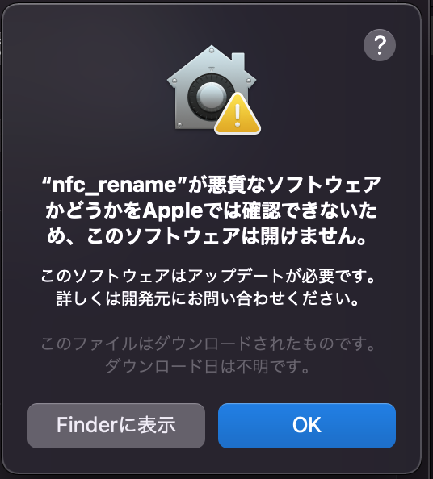
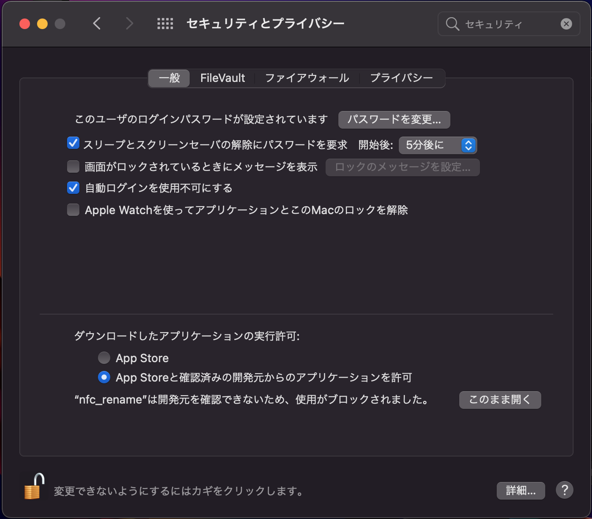

# nfc-rename

NFC-Rename is a desktop application (Mac/Windows) that manages recording file names for Nocturnal Flight Calls (NFC). The recording date and time and site name are added to the beginning of the file name.

## 概要：

- ファイル名に6桁で表される"録音日時"、"録音開示時刻"、"録音終了時刻"とサイト名を追加します。
- 録音日時はファイルスタンプと音声の長さから、サイト名はユーザ入力により生成されます。
- 音声データが2GBを超えるとICレコーダによってはタイムスタンプが同じで自動分割されるので、この録音時間を復元時ます。
- マルチプラットフォームで動作します。仕組みはpythonとfletを用いました。
- 対応するICレコーダは追加予定で、**オリンパス製のDM-750,LS-7[Ver.0.1]**です。

## 機能：

- nfc録音調査用にファイルのリネーム、ファイル名の復元、タイムスタンプの設定ができます。

#### リネーム：

- フォルダ内の全てのファイルをリネームします。
- DM-750の場合、同一録音で自動分割されたwavファイルの時刻を生成します。
- リネームは６６６＋形式です。666形式のファイルは変換されません。
- ファイルのタイムスタンプはOS上での操作や音声アプリで書き換えられることがあるので、ICレコーダからパソコンに取り込むときにリネームすることをお勧めします。

#### ファイル名の復元：

- ６６６＋形式のファイル名からオリジナルのファイル名に復元できます。
- 復元するときにファイルのタイムスタンプも設定されます。
- ICレコーダによってタイムスタンプが録音開始か録音終了かの２つがあるので、録音したICレコーダの選択してください。

#### タイムスタンプの設定：

- ファイルごとにタイムスタンプを設定できます。
- 複数のファイルを選択でき、同じタイムスタンプに設定することで同一録音に設定することができます。この場合、オリジナルのファイル名は連続している必要があります。
- 日時と時刻の設定は6桁の数字です。

## 使い方：

1. アプリケーションの場所：
   1. MacOSX:
   2. Windows10/11:

1. ICレーダの音声データが入っているデバイスまし句はメモリをPC/Macに接続（マウント）してください。
2. nfc-renameのアプリをダブルクリックしてください。
3. リネーム：
   1. サイト名を入力してください。
   2. ICレコーダを選んでください。もしなければ、追加しますのでご連絡ください。
   3. 音声フォルダを選んでください。ファイル名、タイムスタンプ、長さの情報が表示されます。
   4. 出力フォルダを選んでください。
   5. 変換前後のファイル名を確認して、リネーム実行してください。
   6. ICレコーダの設定を変えたら、再度フォルダを選び直してください。

4. ファイル名復元：
   1. ICレコーダを選択してください。
   2. ファイルを選択してください。
   3. 復元前後のファイル名を確認して、復元ボタンを教えてください。

5. タイムスタンプ変更：
   1. ファイルを選択します。複数選択可能。
   2. 日時と時刻を6桁の数字で入力してください。
      1. 例）2024-01-01　→　240401
      2. 例）12:34:56　　 →　123456

6. タイムスタンプ変更ボタンを教えてください。

## セキュリティ：

- MacOSXではダウンロードしたアプリは直ぐに立ち上げることができないようになっています。

- そのため、**システム設定**で個別に許可してください。左下の南京錠を解除すると選択できるようになります。

