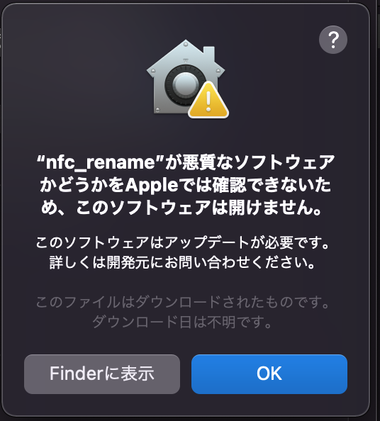
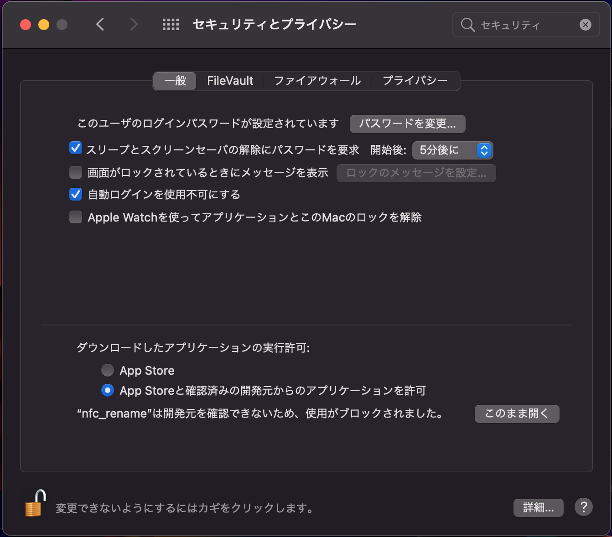

# nfc-rename

NFC-Rename is a desktop application (Mac/Windows) that manages recording file names for Nocturnal Flight Calls (NFC). The recording date and time and site name are added to the beginning of the file name.

## 概要：

- ファイル名に666形式と呼ぶ、6桁で表される"録音日時"、"録音開始時刻"、"録音終了時刻"と、サイト名が追加されます。
- 録音日時はファイルスタンプと音声の長さから、サイト名はユーザ入力により生成されます。
- 音声データが2GBを超えるとICレコーダによってはタイムスタンプが同じで自動分割されるので、この録音時間を復元します。
- マルチプラットフォームで動作します。仕組みはpythonとfletを用いました。
- 対応するICレコーダは**オリンパス製のDM-750、LS-7、TASCAM製のDR-05[Ver.0.9]**です。

## インストール方法：

### Windows:
1. `nfc-rename-windows.zip` をダウンロードします。
2. ダウンロードしたZIPファイルを右クリックし、「すべて展開」を選択します。
3. 展開されたフォルダ内の `nfc-rename.exe` をダブルクリックして実行します。
4. 必要に応じてデスクトップにショートカットを作成することもできます。
5. **重要**: 展開したフォルダ構成は以下のようになっています。この構造を維持したまま使用してください：
   ```
   nfc-rename/
   ├── nfc-rename.exe
   ├── _internal/   # 内部ライブラリ
   │   └── vendors/ # 内部に外部ツールが含まれています
   └── vendors/     # 外部ツールディレクトリ
       └── for_Win/ # Windows用ffmpegツール
   ```

### macOS:
1. `nfc-rename-MacOSX.zip` をダウンロードします。
2. ダウンロードしたZIPファイルをダブルクリックして展開します。
3. 展開された2つの項目があります：
   - `nfc-rename.app` - アプリケーション本体
   - `nfc-rename` - アプリケーションフォルダ（必要なサポートファイルを含む）
4. `nfc-rename.app` を「アプリケーション」フォルダにドラッグ＆ドロップします。
5. `nfc-rename` フォルダも「アプリケーション」フォルダまたはアプリケーションと同じ場所に配置してください。
6. macOSの実際のフォルダ構成は以下のようになっています：
   ```
   nfc-rename/
   ├── nfc-rename      # 実行ファイル
   ├── _internal/      # 内部ライブラリ
   │   └── vendors/    # 内部に外部ツールが含まれています
   └── vendors/        # 外部ツールディレクトリ
       └── for_Mac/    # macOS用ffmpegツール
   
   nfc-rename.app/     # macOSアプリケーションバンドル
   └── Contents/
       ├── MacOS/
       ├── Resources/
       └── ...
   ```
7. 初回起動時にセキュリティの警告が表示された場合は、下記の「セキュリティ」セクションの手順に従ってください。

### 外部依存ツール:
アプリケーションは以下の外部ツールを使用しています：
- **ffmpeg**: 音声ファイルの分割や情報取得に使用
- **ffprobe**: 音声ファイルのメタデータ取得に使用

これらのツールはZIPファイル内の `vendors/for_Win`（Windows用）または `vendors/for_Mac`（macOS用）ディレクトリに含まれています。アプリケーションが正常に動作するためには、これらのファイルがアプリケーション本体と共に適切に配置されている必要があります。

## 機能：

- nfc録音調査用にファイルのリネーム、ファイル名の復元、タイムスタンプの設定、音声分割ができます。
- **サイト名キャッシュ**: 入力したサイト名は次回起動時に自動で読み込まれます。

#### リネーム：

- フォルダ内の全てのWAVファイルとMP3ファイルをリネームします。
- DM-750やLS-7の場合、同一録音で自動分割されたファイルでも録音開始時刻を正確に生成します。
- リネームは６６６＋形式です。すでに666形式のファイルは変換されません。
- ファイルのタイムスタンプはOS上での操作や音声アプリで書き換えられることがあるので、ICレコーダからパソコンに取り込むときにリネームすることをお勧めします。
- 同一録音（同じタイムスタンプを持つファイル）は自動で検出され、ファイル名が連続する順に正しい録音時間情報でリネームされます。

#### ファイル名の復元：

- 666形式のファイル名からオリジナルのファイル名に復元できます。
- 復元するときにファイルのタイムスタンプも設定されます。
- ICレコーダによってタイムスタンプが録音開始か録音終了かの2種類があるので、録音したICレコーダを選択してください。

#### タイムスタンプの設定：

- ファイルごとにタイムスタンプを設定できます。
- 複数のファイルを選択でき、同じタイムスタンプに設定することで同一録音に設定することができます。この場合、オリジナルのファイル名は連続している必要があります。
- 日時と時刻の設定は6桁の数字で入力します。

#### 音声分割：

- 666形式のファイルを1時間ごとに分割することができます。
- 分割は0分0秒ちょうどで行われ、新しいファイル名も666形式で生成されます。
- 長時間録音ファイルを処理しやすい1時間単位に分割するのに便利です。

## 使い方：

1. アプリケーションの場所：
   1. MacOSX:
   2. Windows10/11:

1. ICレコーダの音声データが入っているデバイスまたはメモリをPC/Macに接続（マウント）してください。
2. nfc-renameのアプリをダブルクリックしてください。
3. リネーム：
   1. サイト名を入力してください。
   2. ICレコーダを選んでください。もしなければ、追加しますのでご連絡ください。
   3. 音声フォルダを選んでください。ファイル名、タイムスタンプ、長さの情報が表示されます。
   4. 出力フォルダを選んでください。
   5. 変換前後のファイル名を確認して、リネーム実行してください。
   6. ICレコーダの設定を変えたら、再度フォルダを選び直してください。

4. ファイル名復元：
   1. ICレコーダを選択してください。
   2. ファイルを選択してください。
   3. 復元前後のファイル名を確認して、復元ボタンを押してください。

5. タイムスタンプ変更：
   1. ファイルを選択します。複数選択可能。
   2. 日時と時刻を6桁の数字で入力してください。
      1. 例）2024-01-01　→　240101
      2. 例）12:34:56　　 →　123456
   3. タイムスタンプ変更ボタンを押してください。

6. 音声分割：
   1. 666形式のファイルを選択します。
   2. 「1時間ごとに分割」ボタンを押してください。
   3. 分割結果が表示されます。

## ICレコーダーの特性：

- **DM-750**、**LS-7**（オリンパス）：タイムスタンプは録音開始時刻です。2GBを超えると自動分割され、すべての分割ファイルは同じタイムスタンプを持ちます。
- **DR-05**（TASCAM）：タイムスタンプは録音終了時刻です。

## バージョン情報：

- **Ver.0.9 (2024-05-20)**:
  - サイト名のキャッシュ機能: 入力したサイト名を次回起動時に自動で読み込み
  - 同一録音対応機能: タイムスタンプが同じで自動分割された録音ファイルを正確に処理
  - ファイル名の復元機能: 666形式のファイル名からオリジナルに復元
  - タイムスタンプの設定機能: 複数ファイルの一括処理に対応
  - 1時間ごとの音声分割機能: 長時間録音を処理しやすい単位に分割
  - DM-750, LS-7の同一録音の録音開始時刻が正しく計算されるよう修正
  - macOSとWindows両対応のクロスプラットフォーム実装
  - ffmpegのOS別自動判別機能の強化

## セキュリティ：

- MacOSXではダウンロードしたアプリは直ぐに立ち上げることができないようになっています。



- そのため、**システム設定**で個別に許可してください。左下の南京錠を解除すると選択できるようになります。



## トラブルシューティング：

### 外部依存ファイル関連の問題：

- **「ffmpegコマンドが見つかりません」エラーが表示される場合：**
  1. アプリケーションのフォルダ構造が維持されているか確認してください。
  2. Windowsの場合:
     - `nfc-rename/vendors/for_Win` ディレクトリに `ffmpeg.exe` などのファイルが存在すること
     - `nfc-rename/_internal/vendors` ディレクトリも必要に応じて確認
  3. macOSの場合:
     - `nfc-rename/vendors/for_Mac` ディレクトリに `ffmpeg` などのファイルが存在すること
     - `nfc-rename.app` と `nfc-rename` フォルダが同じ場所に配置されていること
  4. それでも問題が解決しない場合は、ZIPファイルを再ダウンロードして、展開後にフォルダ構造を変更せずにそのまま使用してください。

- **macOSでアプリケーションが起動できない場合:**
  1. `nfc-rename.app` と `nfc-rename` フォルダが同じ場所（「アプリケーション」フォルダ内など）に配置されていることを確認してください。
  2. ターミナルを開き、以下のコマンドでアプリケーションフォルダ内のファイル権限を確認：
     ```
     ls -la /Applications/nfc-rename
     ls -la /Applications/nfc-rename/vendors/for_Mac
     ```
  3. 必要に応じて実行権限を付与（ターミナルで）：
     ```
     chmod +x /Applications/nfc-rename/vendors/for_Mac/ffmpeg
     chmod +x /Applications/nfc-rename/vendors/for_Mac/ffprobe
     ```

- **音声分割機能が動作しない場合：**
  1. 選択したファイルが666形式になっているか確認してください。
  2. ファイルが壊れていないか（再生できるか）確認してください。
  3. 十分なディスク容量があるか確認してください。
  4. 対象のWAVファイル形式がサポートされているか確認してください（44.1kHz/16bitのPCMが推奨）。

- **macOSでの「開発元を確認できないため開けません」エラー：**
  1. 「システム環境設定」→「セキュリティとプライバシー」を開きます。
  2. 「一般」タブで「このまま開く」ボタンをクリックします。
  3. 上記「セキュリティ」セクションの手順も参照してください。

- **ログファイルの確認：**
  アプリケーションの動作に問題がある場合、以下の場所にあるログファイルを確認すると詳細な情報が得られます：
  - Windowsの場合: `C:\Users\<ユーザー名>\.nfc\nfc-rename.log`
  - macOSの場合: `/Users/<ユーザー名>/.nfc/nfc-rename.log`